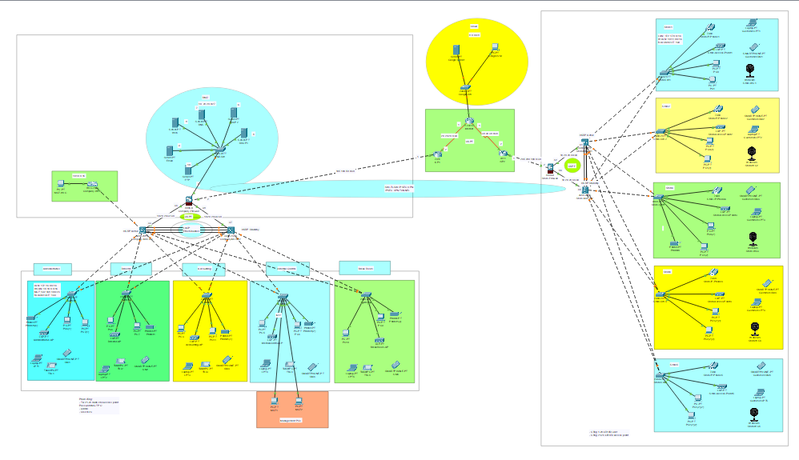

# Design, Implementation, and Network Administration for the Management Office and Retail Space of the Okono Store Chain

This project focuses on the design, implementation, and administration of a WAN network for the Okono Store chain, aiming to ensure high availability, security, and scalability.

The network is built using Cisco Packet Tracer and incorporates modern security technologies and protocols such as IPsec VPN, Cisco ASA firewalls, VLAN, OSPF, EtherChannel, and HSRP. Additionally, the project includes server virtualization, efficient IP subnet allocation, and comprehensive testing to optimize network performance and security.

## Technology

Cisco Packet Tracer v8.2.2

## Design Objectives

After receiving the requirements, the team developed the design based on the following key criteria:

- Prioritizing high performance, fast, and continuous connectivity (download/upload speeds of approximately 100Mbps per device).

- Ensuring an infrastructure design with a compact architecture and scalability.

- High availability with contingency planning for failures.

- Strong security capabilities.

## Network Architecture Components

- Internet Service Provider (ISP): The company has signed a contract with ISP to ensure stable Internet connectivity.

- Network Security: Two Cisco ASA firewalls from the 5500-X series have been implemented to enhance security. Each location has its own firewall, but the main site hosts the DMZ or server cluster.

- Routing: Both firewalls and core switches are used for routing.

- Switching Infrastructure: The network includes two Catalyst 3850 48-port switches for the company and Catalyst 2960 48-port switches for each store, ensuring strong internal network connectivity.

- Server Hardware & Virtualization: Physical servers utilize virtualization to manage multiple virtual machines for different services. To ensure redundancy, two DHCP servers operate simultaneously.

- Wireless Infrastructure: A Cisco Wireless LAN Controller (WLC) and Lightweight Access Points (LAPs) are deployed for seamless wireless network management. The WLC is installed in the server room and manages all access points.

- VPN IPsec Site-to-Site: Configuring IPsec VPN on both firewalls to enable secure communication between the main office and branch offices.

## Technical Requirements

- Hierarchical Design: Implement a hierarchical model combined with redundancy to enhance network recovery capabilities and availability.

- ISP: Establish a connection with the ISP router from ISP Viettel within the network infrastructure.

- WLC: Ensure that each department and store is equipped with Wireless Access Points (WAP) to provide WiFi access for employees, business users, departments (administration, management, internal control, entertainment, accounting), and guests. All access points are centrally managed by the Wireless LAN Controller (WLC).

- VLAN: Maintain VLANs for the following IDs: 10 for Management, 20 for LAN, 50 for WLAN, and finally, 199 for Blackhole.

- EtherChannel: Implement the Link Aggregation Control Protocol (LACP) to configure EtherChannel, enhancing link aggregation efficiency, providing redundancy, and improving network bandwidth utilization.

- STP PortFast and BPDUguard: Configure Spanning Tree Protocol (STP) PortFast and BPDUguard to accelerate port transition from blocking state to forwarding state.

- Subnetting: Utilize subnetting techniques to allocate IP addresses appropriately for each network group.

- Basic Configuration: Configure basic device settings, including hostnames, console passwords, enable passwords, banner messages, password encryption, and disable IP domain lookup.

- Inter-VLAN Routing: Allow devices in all departments to communicate by configuring the appropriate multilayer switch.

- Core Switch: Assign IP addresses to the multilayer switch to enable routing and switching functionalities.

- DHCP Server: Ensure that all devices in the network receive appropriate IP addresses through the DHCP server located in the DMZ.

- HSRP: Deploy high-availability routing protocols such as HSRP to achieve redundancy, load balancing, and failover capabilities.

- Static IP: Assign static IP addresses to devices located in the server room.

- Routing Protocol: Use Open Shortest Path First (OSPF) as the routing protocol to advertise dynamic routes on firewalls, routers, and multilayer switches.

- Standard ACL for SSH: Configure a standard ACL on VTY to restrict remote management tasks via SSH to security engineers’ PCs with high-level network privileges.

- Cisco ASA Firewall: Configure static routing, basic settings, security levels, zones, and policies on the Cisco firewall to define access control and resource usage within the network.

- Final Testing: Conduct thorough testing to verify that communication is appropriate and ensure all configured components function as expected.

## Completed product

<strong>OKONO Store WAN Network</strong>

## Usage

To run the network diagram, use Cisco Packet Tracer v8.2.2 and open the .pkt file for the best performance.

## Reference

- Oppenheimer, P. (2011). Top-down network design, Third edition. Networking Technology
- Youtube
